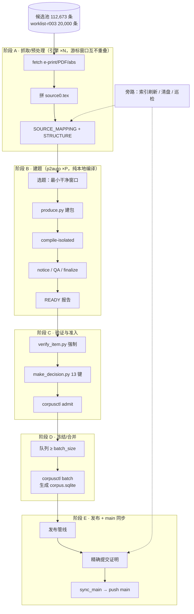

# 语料自动化系统 · 架构示意图 / Pipeline architecture

> 目标：**找题、转 TeX、建库、发布四条流水线互不阻塞**；任一阶段卡住不影响其它阶段继续干活。
> 版本：2026-10-06。文件位置：`editable-corpus/PIPELINE_ARCHITECTURE.md`（随包公开）+ 本机工作区副本。

## 一、总览（ASCII）

```
        ┌─────────────────── 供给（只读池，可无限扩） ───────────────────┐
        │ arxiv-snapshot-r002/candidates.json  112,673 条 CC BY 4.0 数学  │
        │ worklist-r003.json 20,000 条（生产顺序，游标窗口互不重叠）        │
        └───────────────────────────────┬───────────────────────────────┘
                                        │  每个引擎独占一段游标窗口
        ┌───────────────────────────────▼───────────────────────────────┐
        │ 阶段 A · 抓取/预处理  (engine9/10/11 …，P=4，可加台数)           │
        │   fetch e-print + 版本 PDF + abs.html → 拼 source0.tex          │
        │   产物：SOURCE_MAPPING.json · STRUCTURE-r001.json               │
        │   特性：**不碰控制器**，发布期间照跑；失败写 FETCH-FAILURE.json   │
        └───────────────────────────────┬───────────────────────────────┘
                                        │ 预抓取池（目录即队列）
        ┌───────────────────────────────▼───────────────────────────────┐
        │ 阶段 B · 建题 (p2auto.py，P=8，可加并发)                        │
        │   选题（§11 最小干净窗口）→ produce.py 建包 → compile-isolated   │
        │   → 许可 notice → render/QA → finalize_lane（每修订仅一次）      │
        │   产物：package-root-* · build-root-* · receipts-root-* · READY │
        │   特性：**纯本地编译，不联网、不碰控制器**，与发布完全并行         │
        └───────────────────────────────┬───────────────────────────────┘
                                        │ READY 报告
        ┌───────────────────────────────▼───────────────────────────────┐
        │ 阶段 C · 验证与准入 (admit_loop2.sh)                            │
        │   verify_item.py（强制，FAIL 必修/WARN 不重建）                 │
        │   → make_decision.py（13 键）→ corpusctl admit                  │
        │   失败：ADMIT-SKIP.txt（留证，不污染语料）                       │
        └───────────────────────────────┬───────────────────────────────┘
                                        │ 队列 PRODUCTION_QUEUE.json
        ┌───────────────────────────────▼───────────────────────────────┐
        │ 阶段 D · 冻结/合并 (freeze_merge_loop.sh)                       │
        │   队列 ≥ batch_size → corpusctl batch（构建 corpus.sqlite）      │
        │   先等构建进程归零（避免 Errno 11）→ 失败退避重试                │
        └───────────────────────────────┬───────────────────────────────┘
                                        │ 已合并批次
        ┌───────────────────────────────▼───────────────────────────────┐
        │ 阶段 E · 发布 + main 同步 (auto_publish_resident.ps1)           │
        │   发布管线 → public_exact_commit_full<N>_restored_verified      │
        │   → sync_main.ps1（双亲树级合并）→ push main                    │
        └───────────────────────────────┬───────────────────────────────┘
                                        │
        ┌───────────────────────────────▼───────────────────────────────┐
        │ 旁路（与主链并行，互不阻塞）                                    │
        │  · index_refresh.sh  每 8 分钟：清单/目录/台账重建 + 注入新包    │
        │  · cleanup_loop.sh   每 20 分钟：白名单清盘（绝不删 build-root） │
        │  · corpus-pipeline.sh status/start/stop：一屏巡检与启停          │
        └───────────────────────────────────────────────────────────────┘
```

## 二、Mermaid 版（GitHub 上直接渲染）



## 三、阶段契约（谁碰什么，保证互不阻塞）

| 阶段 | 输入 | 输出 | 是否联网 | 是否碰控制器 | 可否在发布期间运行 |
|---|---|---|---|---|---|
| A 抓取 | 游标窗口内的候选 id | `SOURCE_MAPPING.json`、`STRUCTURE-r001.json` | ✅（代理，P≤6） | ❌ | ✅ **可以** |
| B 建题 | 已预处理目录 | `package/build/receipts-root`、`READY-root` | ❌ | ❌ | ✅ **可以** |
| C 准入 | READY | 队列行 + 13 键决策 | ❌ | ✅（`admit`） | ✅（写队列，不冲突） |
| D 冻结/合并 | 队列满 | `merge/package`（含 `corpus.sqlite`） | ❌ | ✅（`batch`） | ⚠️ 需空闲进程槽（脚本等待重试） |
| E 发布 | 已合并批次 | 精确提交证明 + main 更新 | ✅（GitHub） | ❌ | — |

**解耦要点**（本轮修正）：引擎原先在 `pending_publication` 时**整体等待**，导致"发布 15 分钟 = 生产停 15 分钟"。修正为：
- A/B 阶段**不再看控制器状态**，持续生产；
- 只有 D（合并）在开工前**等待构建进程归零**（`Errno 11` 的根因），其余阶段不受影响。

## 四、加并行的方法（已支持）

```bash
# 现状：3 台引擎（游标 0 / 7000 / 14000，各 40 轮）
bash takeover-tools/corpus-pipeline.sh start 6      # 一键加到 6 台（自动分配不重叠的游标窗口）
bash takeover-tools/corpus-pipeline.sh status       # 看每台游标与最后一轮结果
```
- **阶段 A 并行度** = 引擎台数（受 arXiv 限流约束，代理 + P=4/台，实测 3 台稳定）；
- **阶段 B 并行度** = `xargs -P`（当前 8；纯本地编译，可继续加）；
- **阶段 C** 单进程（快，且需与控制器串行）；
- **阶段 D/E** 由控制器与发布管线串行（每批一次）。

## 五、健康判据（巡检三看）

1. `status` 里 **`fetch N`**：若某台连续 `sweep 0` / `fetch 0` → **游标越界**，生成下一份 worklist；
2. `READY` 与 `queued` 是否同步增长 → 若 READY 涨而队列不涨，检查 `ADMIT-SKIP.txt` 原因分布；
3. 发布日志是否出现 `main sync ->` → 缺了就说明 main 没跟上（本轮已自动化，正常情况下每批都有）。

